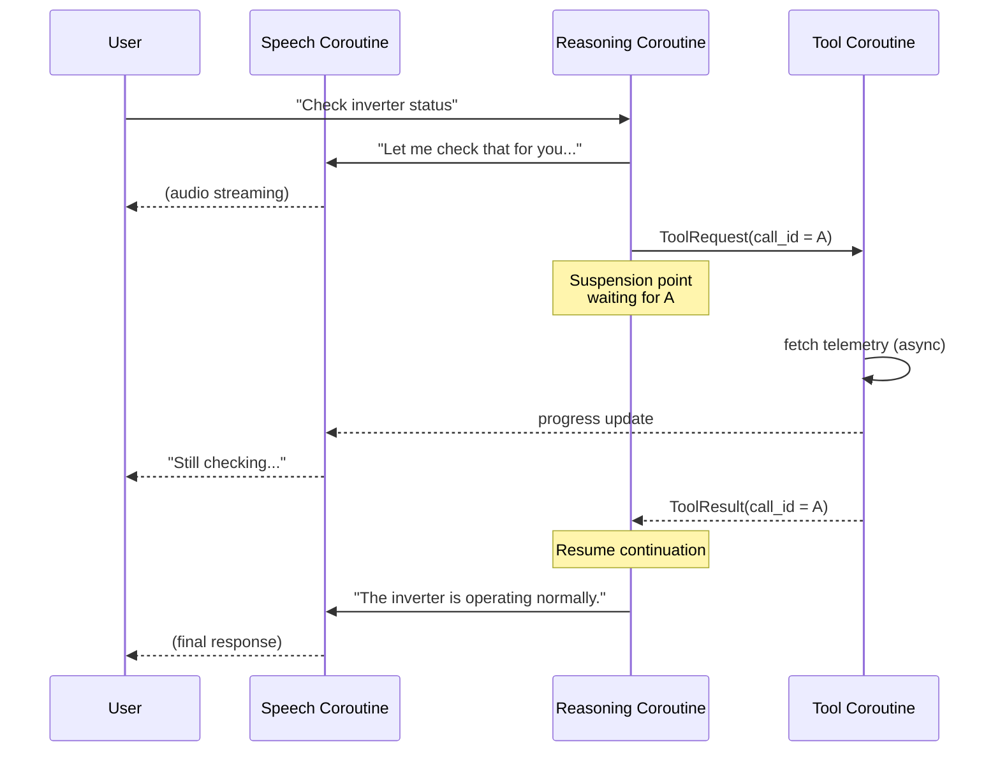

# `knud`

I've been experimenting with OpenAI's realtime voice SDK for the past few weeks, and I've consistently run into strange/unconstrained behavior. And it appears liek I'm not alone in this problem -- there are reports of [tool calling problems](https://community.openai.com/t/realtime-api-tool-calling-problems-no-response-when-a-tool-is-included-in-the-session/966495/6), which are the most relevant for me. This has led to some toxic information bleeding into the context window, but this is all preventable with a carefully designed state machine to encapsulate the intended behavior of the client and _only allow correct actions_ to fill the context. Correctness guarantees in the context of realtime agents is especially important because they are (1) exposed to more unstable external data (corrupted audio input) and have to be reasoned about as a time-dependent state machine in a way that typical LLMs aren't to the same extent.

To solve this, I propose a framework to reify the implicit state machine hidden in Sam Altman's servers using [protothreads](https://dunkels.com/adam/pt/expansion.html) (`knud` is a substring of "Dunkels" reversed), where now tool calling is now reasoned about as coroutines which enforces (1) atomicity (2) alignment and (3) type grounding. The invariants that I'm designing around are 

+ Partial tool results don't induce hallucinations
+ Tool results can only resume continuations with matching `call_id`
+ Safe cancellation for tool resutls
+ Deterministic joins for parallel calls into specific named slots instead freely appended on arrival order

> But aren't function calls kind of subroutine-shaped? 
Yeah but for sufficiently complicated logic, realtime orchestration across many function calls acts closer to a coroutine. 

From Dunkels:
 _In practical terms: replace the traditional "call" primitive with a slightly different one. The new "call" will save the return value somewhere other than on the stack, and will then jump to a location specified in another saved return value. So each time the decompressor emits another character, it saves its program counter and jumps to the last known location within the parser - and each time the parser needs another character, it saves its own program counter and jumps to the location saved by the decompressor. Control shuttles back and forth between the two routines exactly as often as necessary._

The problem that I've been running into is that the realtime agent SDKs that I've been working with have been treating both the server and client behavior as a subroutine, but the user experience should semantically be closer to a coroutine. Voice models are temporal whereas my mental model of subroutines are one that involve halting/mutices over resources (in this case prevents the model from advancing until the function call is evaluated). This is made explicit in the way that OpenAI's realtime SDK exposes a weakly structured subroutine. 

_Generated using an LLM_

